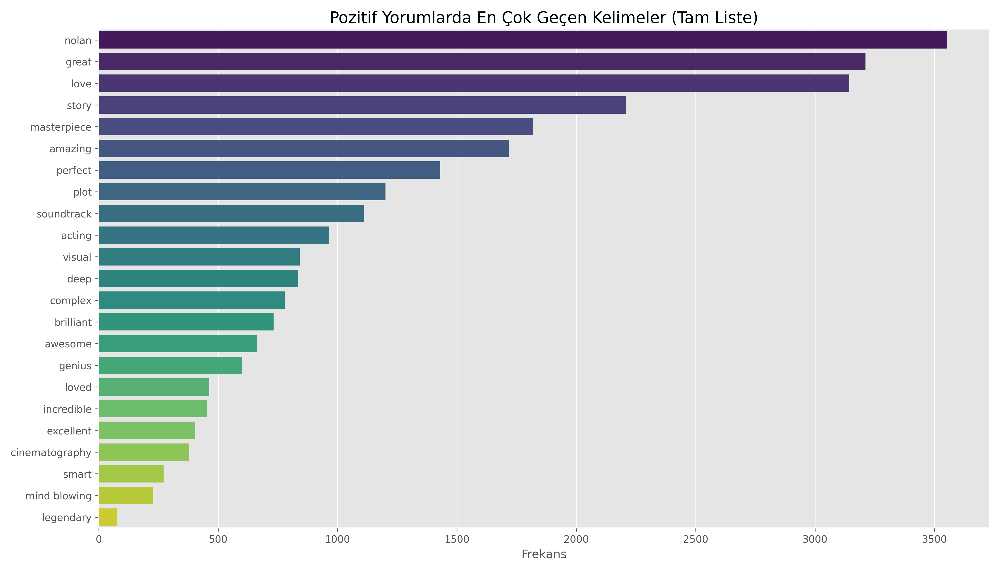
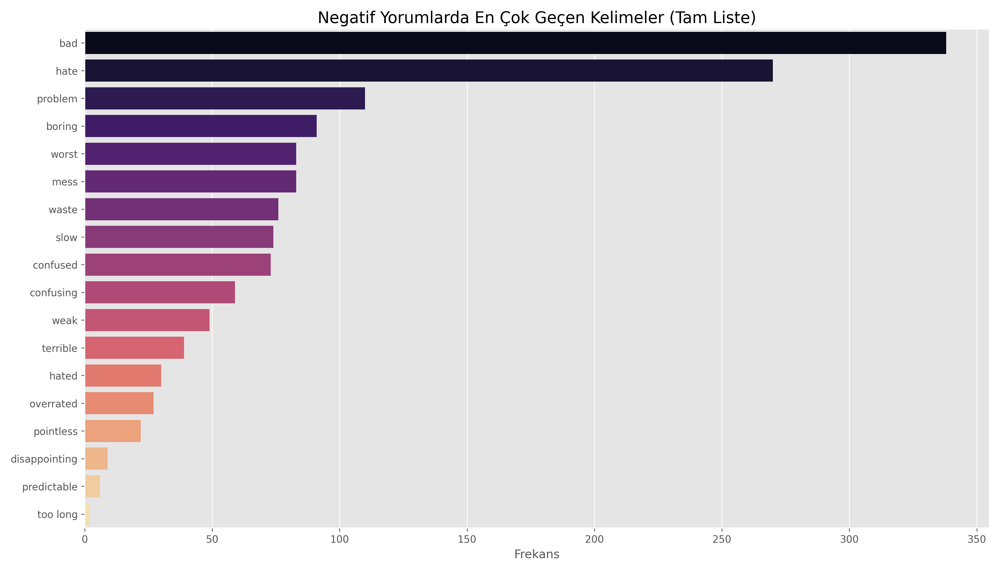
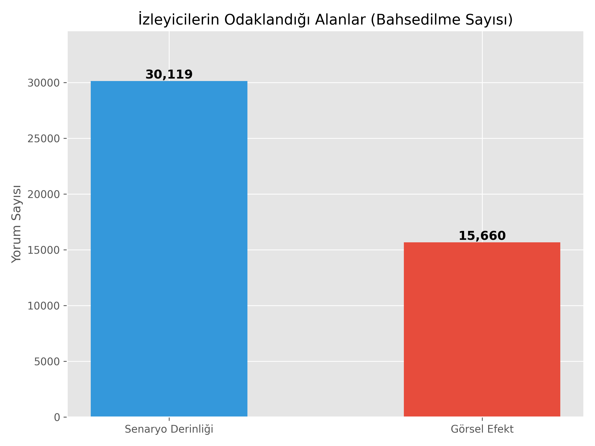
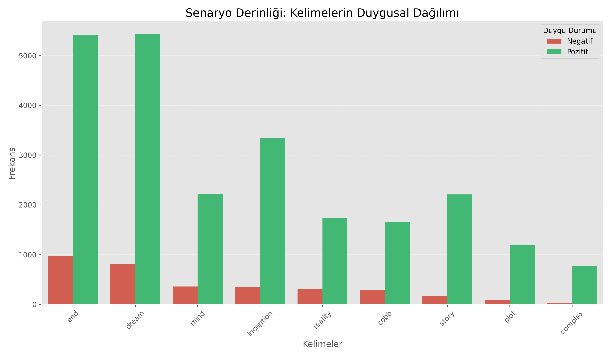
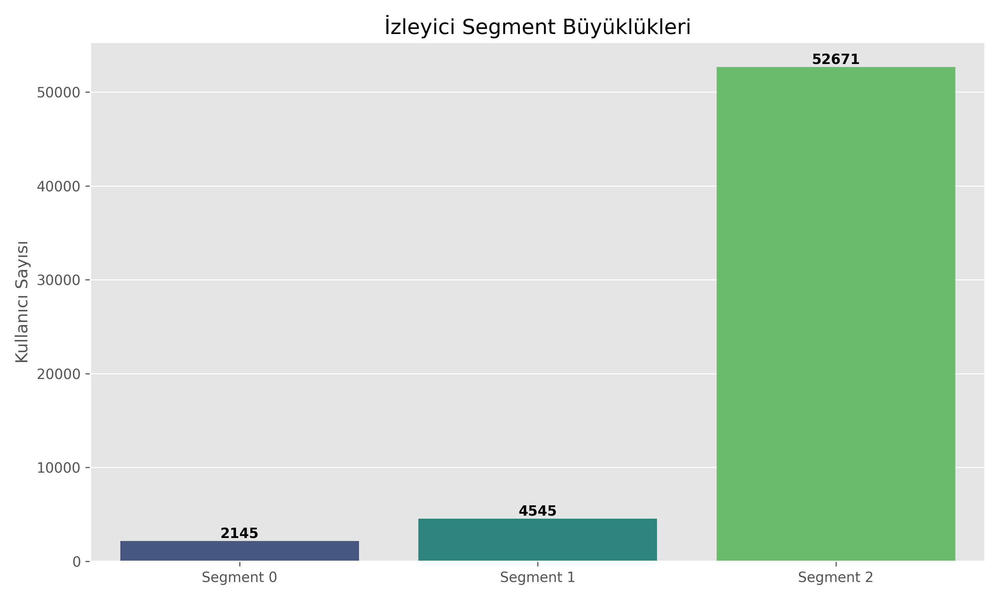
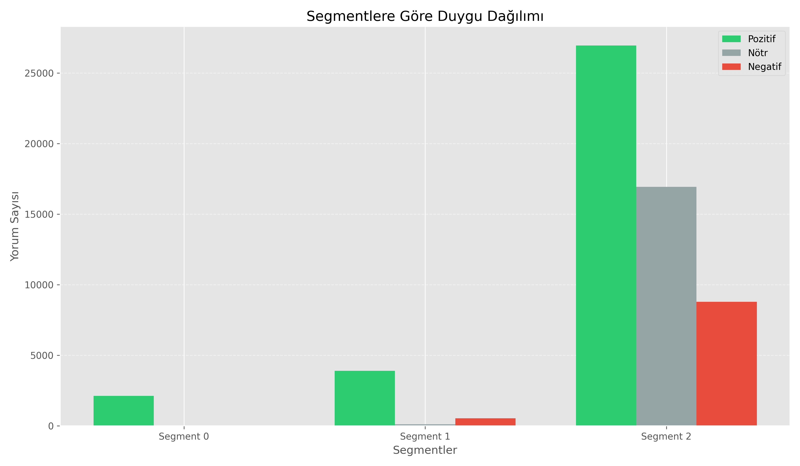
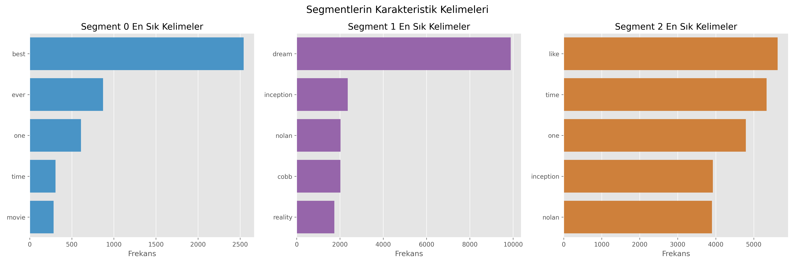

# 🧠 Inception Yorum Analizi
**Youtube linki:** https://youtu.be/Asob7XW-3Gs

**"Bir fikir, virüs gibidir. Dayanıklıdır, oldukça bulaşıcıdır."** - *Inception*

Bu proje, Christopher Nolan'ın kült filmi **Inception** hakkında yapılan binlerce Youtube yorumunun, modern Veri Bilimi ve Doğal Dil İşleme (NLP) yöntemleriyle analiz edilmesini kapsamaktadır. Amacımız, izleyicilerin filme bakış açısını, tartışma konularını ve farklı izleyici profillerini veriye dayalı olarak ortaya koymaktır.

Aşağıda, proje boyunca gerçekleştirilen işlemlerin özeti ve elde edilen grafiklerle desteklenmiş detaylı analiz sonuçları yer almaktadır.

---

##  Gerçekleştirilen İşlemler

1.  **Veri Toplama:** Toplam **69,833** ham yorum toplandı.
    *   **YouTube:** Aşağıdaki videolardan toplam **65,874** yorum çekildi:
        *   [Inception Trailer 1](https://www.youtube.com/watch?v=RxabLA7UQ9k)
        *   [Inception Trailer 2](https://www.youtube.com/watch?v=XQPy88-E2zo)
        *   [Inception Soundtrack](https://www.youtube.com/watch?v=YoHD9XEInc0)
    *   **IMDb:** Toplam **3,979** kullanıcı yorumu eklendi.
2.  **Veri Ön İşleme (Preprocessing):** Toplam 69,833 yorumdan, filtreleme sonrası **59,362** anlamlı veri kaldı.
    *   Emoji, link ve gereksiz karakter temizliği yapıldı.
    *   Tüm metinler küçük harfe çevrildi (normalization).
    *   Stopwords (ve, ile, ama vb.) çıkarıldı ve kelimeler köklerine indirildi (lemmatization).
    *   Tüm yorumlarda dil tespiti yapıldı.
    *   İngilizce olmayan yorumlar ingilizceye çevrildi.
3.  **Duygu Analizi (Sentiment Analysis):** İki aşamalı bir doğrulama sistemi kullanıldı.
    *   `duygu_analiz.py`: İlk etapta Kural Tabanlı (Rule-Based) yöntem ve karmaşık vakalar için LLaMA modeli ile analiz yapıldı ve doğruluk %75-½80 arası saptandı.
    *   `duygu3.py`: Nihai sonuçlar için **VADER** (Valence Aware Dictionary and sEntiment Reasoner) algoritması kullanılarak tüm veri seti Pozitif, Negatif ve Nötr olarak etiketlendi.Doğruluk oranında artış meydana geldi ve %85 oldu. Raporlanan grafikler bu scriptin çıktılarına dayanmaktadır.
4.  **Kelime Frekans Analizi:** Hangi kelimelerin ne sıklıkla geçtiği sayıldı.
5.  **Müşteri (İzleyici) Segmentasyonu(Kümeleme):** K-Means kümeleme algoritması ile izleyiciler benzer yorum davranışlarına göre gruplara ayrıldı.
6.  **Konu Modelleme:** Senaryo, görsel efektler ve müzik gibi spesifik konuların tartışılma yoğunluğu ölçüldü.

---

## 1. Duygu Durumu ve Genel Atmosfer

İzleyicilerin filme genel yaklaşımı nasıldır?

Veriler incelendiğinde, izleyici kitlesinin filme karşı ezici bir çoğunlukla **olumlu** yaklaştığı görülmektedir.

*   **Pozitif:** 32,961 yorum
*   **Nötr:** 17,040 yorum
*   **Negatif:** 9,360 yorum

> **Yorum:** Olumsuz yorumların azlığı, Inception'ın genel kabul görmüş bir "başyapıt" statüsünde olduğunu kanıtlar niteliktedir. Nötr yorumların yüksekliği ise filmin sadece "güzel" denilip geçilmediğini, üzerine teknik tartışmaların yapıldığını ve analiz edildiğini gösterir.

---

##  2. En Çok Konuşulan Konular (Kelime Bulutu Verileri)

İzleyicilerin gündeminde neler var?

Tüm veri seti tarandığında en sık kullanılan kelimeler şunlardır:

> **Yorum:**
> *   **Dream (Rüya):** Filmin ana teması olan rüya kavramı, 12.000'den fazla kez geçerek açık ara en çok konuşulan konudur.
> *   **Time (Zaman):** Filmin zaman algısı ve kurgusu izleyicileri derinden etkilemiştir.
> *   **One & Like:** Genel beğeni ve karşılaştırma ifadeleridir.
> *   **Nolan:** Yönetmen, filmin neredeyse kendisi kadar konuşulmaktadır.

### Duygu Bazlı Kelime Analizi

Peki insanlar **neye** kızıyor veya **neyi** övüyor?

#### Pozitif Kelimeler
"Masterpiece" (Başyapıt), "Perfect" (Mükemmel) ve "Genius" (Dahi) kelimeleri öne çıkıyor.

####  Negatif Kelimeler
Az sayıdaki olumsuz yorumda "Bad" (Kötü), "Boring" (Sıkıcı) ve "Confusing" (Kafa karıştırıcı) ifadeleri görülüyor. Filmin karmaşıklığı bazı izleyiciler için negatif bir unsur olmuş.

####  Nötr Kelimeler
Nötr yorumlar daha çok "Soundtrack", "Story" ve "Plot" üzerine odaklı teknik tespitler içeriyor.

###  Analiz Sonuçları ve Çıkarımlar

**Olumlu Yorumlar:**
`nolan`, `great`, `love`, `story`, `masterpiece`, `amazing`
> İzleyiciler filmi yönetmen, hikâye, müzik ve genel kalitesi açısından çok beğenmiş. Yani hem senaryo derinliği hem görsel ve işitsel kalite öne çıkıyor.

**Olumsuz Yorumlar:**
`bad`, `hate`, `problem`, `boring`, `worst`, `mess`
> Olumsuz yorumlar çok daha sınırlı sayıda kelime ile sınırlı ve belirgin bir şikayet var. Film bazı izleyiciler için yavaş veya kafa karıştırıcı olmuş.

**Nötr Yorumlar:**
Hem olumlu hem olumsuz öğeleri içeriyor; `nolan`, `soundtrack`, `genius`, `story`, `deep` gibi kelimeler hem beğeni hem değerlendirme amaçlı kullanılmış.
> Bu da bazı kullanıcıların filmi “değerlendiriyor ama duygusal olarak güçlü tepki vermiyor” anlamına gelir.

#### 2️⃣ Çıkarımlar
*   Senaryo ve karakter derinliği izleyiciler için önemli (`story`, `plot`, `deep`, `complex`).
*   Yönetmen ve görsel-müzik kalitesi de çok beğeniliyor (`nolan`, `music`, `soundtrack`, `visual`, `cinematography`).
*   Olumsuz yorumlar sınırlı ve genellikle “yavaş, kafa karıştırıcı ” olarak öne çıkıyor.

#### 3️⃣ Pazarlama Önerisi
*   Kampanyada hem senaryo derinliğini hem görsel/müzik kalitesini öne çıkarın; her iki özellik de olumlu yorumlarda sıkça geçiyor.
*   Olumsuz geri bildirimler az ama “yavaş” veya “karışık” eleştiriler göz önünde bulundurularak kısa ve net mesajlar kullanılabilir.

---

##  3. Derinlemesine Analiz: Senaryo vs. Görsellik

Inception bir görsel şölen mi, yoksa bir senaryo dehası mı?

Analiz sonuçlarına göre izleyiciler **Senaryo Derinliğine** (30,119 puan), **Görsel Efektlerden** (15,660 puan) yaklaşık iki kat daha fazla önem veriyor.

### Detaylı Bağlam Analizi
Bu kategorilerde hangi kelimeler, hangi duygularla kullanılıyor?

#### Senaryo Derinliği Detayı
"Dream" ve "End" (Son) kelimeleri tartışmaların merkezinde. Filmin sonu hakkındaki teoriler hem olumlu hem olumsuz yorumlarda baskın.

#### Görsel Efekt/Teknik Detay
Hans Zimmer'in müzikleri ("Music", "Soundtrack") ve Nolan'ın yönetmenliği teknik açıdan en çok övülen kısımlar.

###  Sonuç Analizi ve Stratejik Öneriler

#### 1️⃣ Olumlu Yorumlar
*   **Senaryo Derinliği:** `dream`, `end`, `inception`, `mind` kelimeleri pozitif yorumlarda çok yüksek frekansa sahip.
*   **Görsel Efektler:** `music`, `nolan`, `scene` kelimeleri de öne çıkıyor ama senaryo derinliği kadar güçlü bir baskınlığa sahip değil.

#### 2️⃣ Olumsuz Yorumlar
*   **Senaryo:** `end`, `dream`, `inception` ile ilgili eleştiriler (kafa karışıklığı vb.) biraz daha fazla.
*   **Görsel:** `music`, `nolan`, `scene` ile ilgili eleştiriler toplamda daha az.

#### 3️⃣ Çıkarım
> İzleyiciler filmde senaryonun derinliğini, hikaye ve karakter karmaşıklığını daha çok konuşmuş ve değerlendirmiş. Görsellik ve müzik de önemli ama, kampanya için öne çıkarılacak ana özellik **“Senaryo Derinliği”** olmalı. Eğer görsel şov vurgulanacaksa, senaryonun yanında destekleyici olarak kullanılabilir.

####  Sonuç: Pazarlama Stratejisi
*   Pazarlama mesajlarında **“hikayenin derinliği ve zekice kurgulanmış senaryo”** ön planda olmalı.
*   Görsel efektler ikinci planda, hikayeyi güçlendiren bir unsur olarak konumlandırılmalı.

---

##  4. İzleyici Segmentasyonu

Yorumcuları analiz ettiğimizde 3 farklı profil ortaya çıkıyor.

### Segment Büyüklükleri
En büyük grup (Segment 2), genel izleyici kitlesini oluşturuyor.

### Profil Tanımları ve Duygu Durumları
Her segmentin filme yaklaşımı farklıdır:

1.  **Segment 0 (Hayranlar):** Daha kısa, net ve duygu yüklü yorumlar. "Best movie ever" (Gelmiş geçmiş en iyi film) kalıbını en çok kullanan grup.
2.  **Segment 1 (Teorisyenler):** Sayıca az ama öz yorumlar. "Dream", "Reality", "Cobb" gibi hikaye detaylarına odaklanıyorlar. Filmi analiz etmeyi seviyorlar.
3.  **Segment 2 (Genel):** "Like", "Good", "Time" gibi daha genel kelimelerle filmi değerlendiriyorlar.

### Segmentlerin Kelime Tercihleri

### 📈 Segment Analiz Detayları ve Çıkarımlar

#### 🟢 Segment 0 (2145 yorum) - "Sadık Hayranlar"
*   **Pozitif:** `best`, `ever`, `one` öne çıkıyor → Bu segmentte kullanıcılar en yüksek kaliteyi ve genel beğeniyi önemsiyor.
*   **Negatif:** `best`, `without`, `doubt` → Çok az, neredeyse tüm yorumlar olumlu.
*   **Yorum:** Bu segmentteki kullanıcılar fan ve sadık kitleden oluşuyor, genellikle filmi beğenmiş, küçük detaylar dışında eleştiri yok.

#### 🟢 Segment 1 (4545 yorum) - "Hikaye Odaklılar"
*   **Pozitif:** `dream`, `inception`, `nolan`, `cobb`, `reality` → Senaryo ve karakterler öne çıkıyor.
*   **Negatif:** `dream`, `cobb`, `reality`, `life` → Bazı kullanıcılar hikaye veya karakterle ilgili eleştiride bulunmuş.
*   **Yorum:** Bu segment hikaye ve karakter odaklı, senaryonun derinliği ve karmaşıklığı kullanıcıların dikkatini çekmiş. Kampanya mesajlarında senaryo, karakterler ve temalar vurgulanabilir.

#### 🟢 Segment 2 (52671 yorum) - "Genel İzleyici"
*   **Pozitif:** `like`, `time`, `one`, `inception`, `nolan`, `music` → Film genel olarak beğenilmiş, hem hikaye hem görsellik öne çıkıyor.
*   **Negatif:** `time`, `life`, `people` → Bazı kullanıcılar zaman kavramı veya temalarla ilgili eleştirilerde bulunmuş.
*   **Yorum:** Bu segment genel izleyici kitlesi, hem senaryo hem görsel/müzik unsurlarına ilgi göstermiş. Pazarlama kampanyasında senaryonun derinliği ve görsel efektler birlikte öne çıkarılabilir.

####  Genel Çıkarım
*   **Sadık Fan Segmenti (0):** Film genel olarak çok beğenilmiş, kampanyada hayran kitlenin olumlu görüşleri desteklenebilir.
*   **Hikaye Odaklı Segment (1):** Senaryo ve karakterlerin vurgulanması önemli.
*   **Genel İzleyici (2):** Hem senaryo hem görsel efektler dikkate alınmalı.

---

##  5. Beklenti ve Ortak Özellik Analizi

Son olarak, her bir grubun filmden ne beklediğini ve hangi kavramlar etrafında birleştiğini inceledik.

### Genel Kitle Beklentisi
Tüm izleyicilerin ortak paydası "Dream" ve "Time" kavramlarıdır.

### Segment 0 (Hayranlar) Beklentisi
Odak noktaları **"Best"**, **"Ever"**, **"One"**. Onlar için bu film bir rekortmen/zirve noktası.

### Segment 1 (Teorisyenler) Beklentisi
Odak noktaları **"Dream"**, **"Inception"**, **"Cobb"**, **"Reality"**. Onlar filmin felsefesi ve olay örgüsüyle ilgileniyor.

### Segment 2 (Genel) Beklentisi
Odak noktaları **"Time"**, **"Like"**, **"Music"**. Onlar filmin deneyimi ve hissettirdikleriyle ilgileniyor.

###  Segment Beklenti Detayları ve Çıkarımlar

#### 1️⃣ Genel İzleyici (Tüm yorumlar)
*   **Ortak Özellikler:**
    *   Film deneyimine açık, farklı yönleri değerlendiren.
    *   Hem hikaye/senaryoya hem de görsellik ve müziğe önem veriyor.
    *   Düşünmeye ve tartışmaya hevesli (`dream`, `mind`, `inception`, `reality`).
*   **Beklentiler:**
    *   Zihinsel olarak düşündüren senaryo ve karakterler.
    *   Kaliteli müzik ve görsellik.
    *   Filmden genel olarak tatmin edici ve unutulmaz deneyim bekliyor.

#### 2️⃣ Segment 2 (Büyük ve genel izleyici)
*   **Ortak Özellikler:**
    *   Daha geniş ve çoğunluk kitlesi.
    *   Eğlence, beğeni ve keyif odaklı.
    *   Popüler sahnelere ve müziğe dikkat ediyor (`music`, `song`, `nolan`).
*   **Beklentiler:**
    *   Eğlenceli ve sürükleyici görsel deneyim.
    *   Filmden hoşlanma ve keyif alma öncelikli.

#### 3️⃣ Segment 1 (Senaryo derinliği odaklı)
*   **Ortak Özellikler:**
    *   Filmdeki konsept ve zihin açıcı hikayelere yoğun ilgi.
    *   Detayları ve karakterleri analiz etmeyi seviyor (`dream`, `inception`, `cobb`, `mind`).
*   **Beklentiler:**
    *   Karmaşık, derin senaryo ve teorik fikirler.
    *   Zihinsel keşif ve çözümleme fırsatı.
    *   Görsel efektler ikincil önemde.

#### 4️⃣ Segment 0 (Sadık fan kitlesi)
*   **Ortak Özellikler:**
    *   Film ve müziğe yüksek övgü.
    *   Daha önceki film bilgisi ve deneyimi olan kullanıcılar (`best`, `ever`, `music`, `nolan`).
*   **Beklentiler:**
    *   Tanıdık ve sevilen sahnelerin vurgulanması.
    *   Müzik ve görsellik açısından tatmin edici deneyim.
    *   Genel olarak “harika ve eksiksiz” film deneyimi.

####  Özet
*   **Senaryo derinliği**, özellikle **Segment 1** için kritik.
*   **Müzik ve görsellik**, **Segment 2** ve fan kitlesi (**Segment 0**) için öncelikli.
*   **Genel izleyici**, her iki ögeyi de dengeli şekilde ister.

---

##  Sonuç

Bu çalışma göstermiştir ki **Inception**, sadece "izlenip geçilen" bir aksiyon filmi değil, izleyicisini düşündüren, teoriler ürettiren ve senaryosuyla görselliğinden çok daha fazla konuşulan bir yapımdır. Farklı beklentilere sahip 3 kitleyi  aynı "başyapıt" algısında birleştirmeyi başarmıştır.

###  Başarılar
*   **Senaryo Derinliği:** İzleyiciler özellikle `dream`, `inception`, `reality`, `cobb` gibi kavramlara odaklanmış. Bu, hikayenin karmaşıklığı ve derinliğiyle ilgilendiklerini gösteriyor.
*   **Karakterler ve Hikaye:** `Cobb`, `story`, `mind`, `plot` gibi kelimeler sıkça geçiyor; karakterlerin ve hikaye anlatımının güçlü olduğu görülüyor.
*   **Görsel ve İşitsel Kalite:** `Nolan`, `music`, `soundtrack`, `visual`, `acting` gibi kelimeler olumlu yorumlarda çok sayıda geçiyor; film görsel ve işitsel açıdan yüksek kalite sunuyor.
*   **Tutkulu ve Sadık İzleyici Kitlesi:** Segment analizi, özellikle Segment 1 ve 2’de, filmle ilgili derin düşünce ve tartışmaların yapıldığını gösteriyor. Fan kitlesi filmi ciddi bir şekilde analiz ediyor ve takdir ediyor.

###  Öneriler – Daha İyi Olması İçin
*   **Bazı Karmaşık Noktaları Açıklamak:** `Complex`, `mind`, `end` gibi kelimeler olumsuz ve nötr yorumlarda geçiyor; bazı izleyiciler hikayeyi anlamakta zorlanmış olabilir. Pazarlama veya ek içeriklerle filmdeki karmaşıklığı daha anlaşılır hale getirmek faydalı olabilir.
*   **Görsel Efektlerin Daha Fazla Öne Çıkması:** Görsel ve işitsel kalite zaten yüksek, ancak segmentlerde senaryo derinliği öne çıkmış; bazı izleyiciler görselliği daha fazla vurgulayan fragman veya tanıtımları tercih edebilir.
*   **Müzik ve Atmosfer:** `Zimmer`, `soundtrack`, `music` çok olumlu yorum almış; film müziği ve atmosfer öğeleri ile etkileşimi artıracak ek içerikler (ör. film müziği videoları, sahne analizleri) hazırlanabilir.
*   **Karakter ve Finale Odaklanma:** `Cobb`, `end`, `story` gibi kelimeler öne çıkıyor; karakterlerin motivasyonları ve final sahneleri üzerine izleyici rehberliği veya açıklayıcı içerik pazarlamada kullanılabilir.
*   **Sosyal Medya İçerikleri:** İnstgram,Twitter vb platformlarda kısa kesit videolarıyla çarpıcı açıklamalarla yeni izleyicilerin dikkatini çekilebilir.
*   **Film Etkinlikleri:** Film festivalleri vs düzenleyerek,çeşitli dijital reklamlar,bilboardlar düzenleyerek filmi unutturmama yeni izleyicilerde merak uyandırma hissi sağlanmalıdır.
*    **TV de Gösterim:** Film yıldönümlerinde TV de gösterim yapılarak fanların tekrar izlenmesi sağlanabilir.
  

> **Özet:** Filmde en iyi yapılan şey senaryo derinliği ve karakter/film müziği ile görsel atmosferin kalitesi. Daha iyi olabilmesi için karmaşık hikaye noktalarını biraz daha anlaşılır kılmak, görsel ve müzik deneyimini pazarlama ve ek içeriklerle desteklemek faydalı olur.

---
*Analiz & Raporlama - Python Veri Analizi Aracı*
